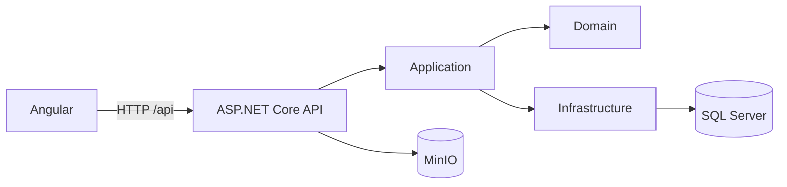

# Stefanini — Gestão de Pedidos

[](https://github.com/jeive-tech-tests/stefanini-desafio-pedidos/releases/latest)

Solução do **Desafio Full Stack .NET + Angular v4**. O projeto oferece um CRUD completo de pedidos, com API REST em .NET, interface responsiva em Angular, persistência em SQL Server, testes automatizados e execução integrada com Docker.

## Visão geral

- criação, consulta, edição e exclusão de pedidos;
- cálculo do valor total no backend e no frontend;
- preço unitário preservado no item no momento da compra;
- filtros por cliente e situação do pagamento;
- paginação da listagem;
- respostas de erro padronizadas com `ProblemDetails`;
- Swagger/OpenAPI;
- migration e catálogo inicial de produtos;
- testes unitários dos fluxos obrigatórios de GET e POST;
- frontend integrado à API;
- imagem única da aplicação e SQL Server no Docker Compose.

## Tecnologias

| Camada              | Tecnologia                                                |
| ------------------- | --------------------------------------------------------- |
| API                 | .NET 10, ASP.NET Core, Entity Framework Core              |
| Arquitetura         | Clean Architecture, DDD tático, Repository e Unit of Work |
| Banco de dados      | SQL Server 2022                                           |
| Documentação da API | Swagger/OpenAPI                                           |
| Frontend            | Angular 21, PrimeNG 21, Tailwind CSS 4, TypeScript 5.9, RxJS |
| Testes              | xUnit, NSubstitute e Vitest                               |
| Objetos             | MinIO para imagens dos produtos                           |
| Infraestrutura      | Docker e Docker Compose                                   |

## Arquitetura



As dependências apontam para o centro da aplicação:

- **Domain** concentra entidades, invariantes e regras de negócio;
- **Application** contém casos de uso, contratos, DTOs e serviços;
- **Infrastructure** implementa persistência com EF Core e SQL Server e acesso às imagens no MinIO;
- **Api** expõe endpoints REST, Swagger e tratamento global de erros;
- **Webapp** entrega a experiência de listagem e manutenção dos pedidos com organização feature-first.

No Angular, `core` concentra configuração transversal, interceptadores e notificações; `layout` contém o shell visual; `shared` reúne o design system reutilizável; e `features/pedidos` mantém páginas, componentes, modelos e serviços do domínio de pedidos próximos entre si. As rotas da feature são carregadas sob demanda, e criação e edição compartilham o mesmo formulário reativo com `FormArray` para os itens. Botões, cards, tabelas e modais são padronizados por `ui-button`, `ui-card`, `ui-table` e `ui-modal`; a criação de pedido usa o modal compartilhado sobre a listagem.

```text
src/Stefanini.Pedidos.Webapp/src/app/
├── core/                  # configuração, interceptor e notificações
├── layout/                # header e shell da aplicação
├── shared/                # design system, estados visuais e utilitários
└── features/pedidos/      # componentes, páginas, modelos, rotas e serviços HTTP
```

## Executar tudo com Docker

Pré-requisito: Docker Desktop ou Docker Engine com Compose.

1. Opcionalmente, crie um arquivo `.env` a partir do exemplo e troque a senha:

   ```bash
   cp .env.example .env
   ```

   Se a porta local `1433` já estiver em uso, altere `MSSQL_HOST_PORT` no `.env`.

2. Suba a aplicação e o banco:

   ```bash
   docker compose up --build
   ```

3. Acesse:

   - aplicação: <http://localhost:8080/stefanini-desafio-pedidos/>
   - Swagger: <http://localhost:8080/stefanini-desafio-pedidos/swagger>
   - health check interno: <http://localhost:8080/health>
   - console local do MinIO: <http://localhost:9001> (`pedidosadmin` / `Pedidos@2026Minio` no ambiente de desenvolvimento)

O container da aplicação aguarda o SQL Server e a inicialização do bucket do MinIO, aplica as migrations automaticamente e serve o build do Angular pela própria API. Os dados permanecem nos volumes `sqlserver-data` e `minio-data`. O serviço `minio-init` cria o bucket `produtos` e sincroniza as imagens iniciais de `deploy/minio/produtos` de forma idempotente.

Para interromper os containers sem apagar os dados:

```bash
docker compose stop
```

Para remover containers e rede, preservando o volume:

```bash
docker compose down
```

> `docker compose down -v` também apaga definitivamente o banco local e deve ser usado somente quando essa for a intenção.

## Deploy automatizado

O workflow `.github/workflows/deploy.yml` publica automaticamente cada atualização da branch `main` no runner self-hosted de produção.

Fluxo do deploy:

1. o runner obtém exclusivamente o código da `main`;
2. o secret `MSSQL_SA_PASSWORD` é gravado em um `.env` temporário com permissão restrita;
3. o Docker Compose valida, compila e atualiza os containers;
4. o workflow aguarda o endpoint `/health` responder com sucesso;
5. o arquivo `.env` temporário é removido mesmo se o job falhar.

O banco e a aplicação não publicam portas diretamente na rede externa: `1433` e `8080` ficam vinculadas somente a `127.0.0.1`. O Nginx entrega a aplicação publicamente em <https://jeive.dev/stefanini-desafio-pedidos/> e encaminha <https://jeive.dev/stefanini-desafio-pedidos/api/> para a API.

O runner precisa possuir os rótulos `self-hosted`, `Linux`, `X64` e `deploy`. Também é possível executar o workflow manualmente pela interface do GitHub, mas a validação do job impede deploy de qualquer referência diferente de `main`.

O proxy reverso está versionado em `deploy/nginx/jeive.dev.conf`. O certificado TLS de `jeive.dev` e `www.jeive.dev` é emitido pelo Let's Encrypt e renovado pelo timer do Certbot no servidor.

### Versionamento e releases

Depois que o deploy da `main` termina com sucesso, o mesmo workflow publica automaticamente uma [GitHub Release](https://github.com/jeive-tech-tests/stefanini-desafio-pedidos/releases/latest) com versão no formato `v1.0.N`.

Cada release contém:

- notas geradas a partir das mudanças publicadas;
- um pacote ZIP completo e identificado pela versão;
- o checksum SHA-256 do pacote para validação da integridade;
- referência exata ao commit implantado em produção.

O contador `N` é o número incremental de execução do workflow de deploy. Uma reexecução do mesmo workflow é idempotente e não cria uma release duplicada.

## Desenvolvimento local

### Backend

Pré-requisitos: .NET SDK 10 e SQL Server LocalDB, ou uma instância SQL Server acessível.

Com LocalDB no Windows:

```bash
dotnet tool restore
dotnet restore Stefanini.Pedidos.sln
dotnet ef database update --project src/Stefanini.Pedidos.Infrastructure --startup-project src/Stefanini.Pedidos.Api
dotnet run --project src/Stefanini.Pedidos.Api
```

Por padrão, o perfil HTTP inicia a API em <http://localhost:5152>. O Swagger fica em <http://localhost:5152/swagger>.

Para usar apenas o SQL Server do Docker:

```bash
docker compose up -d sqlserver
```

Depois, configure `ConnectionStrings__PedidosDb` no ambiente antes de iniciar a API:

```text
Server=localhost,1433;Database=StefaniniPedidos;User Id=sa;Password=Pedidos@2026Dev;TrustServerCertificate=True
```

### Frontend

Pré-requisito: Node.js 24 com npm.

```bash
cd src/Stefanini.Pedidos.Webapp
npm ci
npm start
```

Acesse <http://localhost:4200>. O proxy de desenvolvimento encaminha `/api` para `http://localhost:5152`.

## Endpoints

| Método   | Rota                | Descrição                             |
| -------- | ------------------- | ------------------------------------- |
| `POST`   | `/api/pedidos`      | cria um pedido                        |
| `GET`    | `/api/pedidos/{id}` | consulta um pedido por id             |
| `GET`    | `/api/pedidos`      | lista pedidos com filtros e paginação |
| `PUT`    | `/api/pedidos/{id}` | atualiza um pedido                    |
| `DELETE` | `/api/pedidos/{id}` | exclui um pedido                      |
| `GET`    | `/api/produtos`     | lista o catálogo de produtos          |
| `GET`    | `/api/produtos/{id}/imagem` | entrega a imagem do produto armazenada no MinIO |

Parâmetros opcionais da listagem:

- `pagina` — número da página, começando em 1;
- `tamanhoPagina` — quantidade de registros, entre 1 e 100;
- `nomeCliente` — trecho do nome do cliente;
- `pago` — `true` ou `false`.

Exemplo:

```http
GET /api/pedidos?pagina=1&tamanhoPagina=10&nomeCliente=maria&pago=false
```

### Criar pedido

```json
{
  "nomeCliente": "Maria da Silva",
  "emailCliente": "maria@email.com",
  "pago": false,
  "itensPedido": [
    {
      "idProduto": 1,
      "quantidade": 1
    },
    {
      "idProduto": 4,
      "quantidade": 2
    }
  ]
}
```

### Consultar pedido

```json
{
  "id": 1,
  "nomeCliente": "Maria da Silva",
  "emailCliente": "maria@email.com",
  "pago": false,
  "valorTotal": 4559.7,
  "itensPedido": [
    {
      "id": 1,
      "idProduto": 1,
      "nomeProduto": "Notebook",
      "valorUnitario": 4299.9,
      "quantidade": 1
    },
    {
      "id": 2,
      "idProduto": 4,
      "nomeProduto": "Mouse",
      "valorUnitario": 129.9,
      "quantidade": 2
    }
  ]
}
```

## Validações e erros

A API valida, entre outros pontos:

- nome e e-mail obrigatórios, com limite de 60 caracteres;
- formato de e-mail;
- ao menos um item por pedido;
- quantidade maior que zero;
- produto existente;
- ausência de produtos duplicados no mesmo pedido.

Erros são retornados no formato `application/problem+json`:

- `400 Bad Request` para dados inválidos;
- `404 Not Found` para pedido ou produto inexistente;
- `409 Conflict` para conflitos de persistência;
- `500 Internal Server Error` para falhas não previstas.

## Migrations e produtos iniciais

A migration inicial cria as tabelas `Pedidos`, `ItensPedido` e `Produtos`, suas chaves e índices. Também cadastra cinco produtos para uso imediato: Notebook, Monitor, Teclado, Mouse e Headset.

Criar uma nova migration:

```bash
dotnet ef migrations add NomeDaMigration --project src/Stefanini.Pedidos.Infrastructure --startup-project src/Stefanini.Pedidos.Api
```

Aplicar migrations manualmente:

```bash
dotnet ef database update --project src/Stefanini.Pedidos.Infrastructure --startup-project src/Stefanini.Pedidos.Api
```

## Testes e qualidade

Backend:

```bash
dotnet test Stefanini.Pedidos.sln
dotnet list Stefanini.Pedidos.sln package --vulnerable --include-transitive
```

Frontend:

```bash
cd src/Stefanini.Pedidos.Webapp
npm run format:check
npm run test:ci
npm run build
npm audit --audit-level=high
```

O workflow de integração contínua em `.github/workflows/ci.yml` executa essas verificações em pushes e pull requests para `main` e `developer`.

## Decisões técnicas

- O valor unitário é copiado para `ItemPedido` ao criar ou atualizar o pedido. Assim, alterações futuras no catálogo não modificam o histórico financeiro.
- Cálculos e validações essenciais permanecem no domínio e no backend; o frontend replica os cálculos apenas para feedback imediato.
- Consultas de leitura usam `AsNoTracking`, enquanto os produtos usados em gravações permanecem rastreados pelo EF Core.
- O frontend usa rotas lazy e serviços tipados, sem depender de uma URL externa fixa.
- As imagens dos produtos ficam no MinIO e são entregues pela API; o Angular não conhece endereço, credencial ou bucket do storage.
- O componente `ui-product-image` padroniza miniaturas circulares e a ampliação acessível por hover ou foco.
- O layout responsivo usa exclusivamente utilitários do Tailwind CSS; PrimeNG fornece os componentes interativos e o tema Aura personalizado.
- No deploy em container, Angular e API compartilham origem e porta; somente o SQL Server permanece como serviço separado e persistente.

## Fluxo de branches

O desenvolvimento foi organizado a partir de `developer`, com branches por etapa:

- `feat/estrutura-backend`;
- `feat/crud-pedidos`;
- `feat/testes-backend`;
- `feat/frontend-angular`;
- `feat/documentacao-deploy`;
- `feat/deploy-main`;
- `feat/dominio-jeive`;
- `feat/versionamento-release`;
- `feat/frontend-primeng-tailwind`.

Cada etapa possui commit próprio em português e merge explícito em `developer`.
